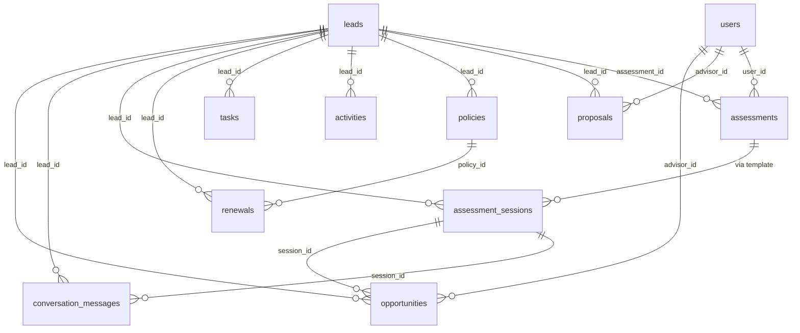

# Database Schema Specification

## 1. Naming Conventions

- **Tables**: lowercase_plural (e.g., `assessments`, `leads`)
- **Columns**: lowercase_snake_case (e.g., `risk_level`, `assessment_id`)
- **Primary keys**: `id INTEGER PRIMARY KEY AUTOINCREMENT`
- **Foreign keys**: `{referenced_table}_id INTEGER`
- **Timestamps**: `created_at DATETIME DEFAULT CURRENT_TIMESTAMP`, `updated_at DATETIME`
- **JSON fields**: `TEXT` (cross-compatible between SQLite and PostgreSQL)
- **Booleans**: `INTEGER DEFAULT 0` (0 = false, 1 = true)
- **Placeholders**: Use `?` (SQLite style, auto-converted to `$1` for PostgreSQL)

## 2. Tables

### 2.1 users
Authentication and role management.

| Column | Type | Constraints |
|--------|------|-------------|
| id | INTEGER | PK AUTOINCREMENT |
| email | TEXT | UNIQUE NOT NULL |
| password_hash | TEXT | NOT NULL |
| name | TEXT | NOT NULL |
| phone | TEXT | |
| business_name | TEXT | |
| industry | TEXT | |
| role | TEXT | DEFAULT 'user' CHECK(role IN ('admin','sales','analyst','user')) |
| created_at | DATETIME | DEFAULT CURRENT_TIMESTAMP |
| updated_at | DATETIME | |

Index: `email` (UNIQUE)

### 2.2 assessments
Risk assessment records.

| Column | Type | Constraints |
|--------|------|-------------|
| id | INTEGER | PK AUTOINCREMENT |
| user_id | INTEGER | FK → users(id) (nullable for WhatsApp users) |
| answers | TEXT (JSON) | NOT NULL |
| score | INTEGER | NOT NULL (0-100) |
| risk_level | TEXT | NOT NULL |
| type | TEXT | DEFAULT 'BUSINESS' CHECK(type IN ('BUSINESS','PERSONAL')) |
| ai_report | TEXT (JSON) | |
| created_at | DATETIME | DEFAULT CURRENT_TIMESTAMP |

Indexes: `user_id`, `created_at`

### 2.3 leads
CRM leads — one per phone number.

| Column | Type | Constraints |
|--------|------|-------------|
| id | INTEGER | PK AUTOINCREMENT |
| name | TEXT | NOT NULL |
| email | TEXT | NOT NULL |
| phone | TEXT | |
| business_name | TEXT | |
| contact_person | TEXT | |
| assessment_id | INTEGER | FK → assessments(id) |
| score | INTEGER | (0-100) |
| risk_level | TEXT | |
| entity_type | TEXT | DEFAULT 'business' |
| status | TEXT | DEFAULT 'New Lead' |
| opportunity_type | TEXT | DEFAULT 'BUSINESS' CHECK IN ('BUSINESS','PERSONAL') |
| wa_state | TEXT | DEFAULT 'initial' |
| primary_concern | TEXT | |
| consultation_preference | TEXT | |
| engagement_points | INTEGER | DEFAULT 0 |
| is_qualified | INTEGER (bool) | DEFAULT 0 |
| notes | TEXT | |
| chat_history | TEXT (JSON) | DEFAULT '[]' |
| assessment_data | TEXT (JSON) | DEFAULT '{}' |
| ccie_context | TEXT (JSON) | |
| birth_date | TEXT | |
| anniversary_date | TEXT | |
| sales_score | INTEGER | DEFAULT 0 |
| pipeline_stage | INTEGER | DEFAULT 1 |
| estimated_premium | INTEGER | DEFAULT 0 |
| lead_source | TEXT | DEFAULT 'CoverScore AI' |
| industry | TEXT | |
| employees | TEXT | |
| recommended_covers | TEXT | |
| assigned_agent | TEXT | |
| created_at | DATETIME | DEFAULT CURRENT_TIMESTAMP |
| updated_at | DATETIME | |

Indexes: `assessment_id`, `status`, `phone`, `pipeline_stage`

### 2.4 proposals
Insurance proposals linked to leads.

| Column | Type | Constraints |
|--------|------|-------------|
| id | INTEGER | PK AUTOINCREMENT |
| lead_id | INTEGER | FK → leads(id) NOT NULL |
| advisor_id | INTEGER | FK → users(id) |
| title | TEXT | NOT NULL |
| content | TEXT | |
| amount | INTEGER | DEFAULT 0 |
| status | TEXT | DEFAULT 'Draft' |
| token | TEXT | UNIQUE NOT NULL |
| created_at | DATETIME | DEFAULT CURRENT_TIMESTAMP |
| updated_at | DATETIME | |

Indexes: `lead_id`, `token`

### 2.5 policies
Issued insurance policies.

| Column | Type | Constraints |
|--------|------|-------------|
| id | INTEGER | PK AUTOINCREMENT |
| lead_id | INTEGER | FK → leads(id) NOT NULL |
| policy_number | TEXT | UNIQUE NOT NULL |
| product | TEXT | NOT NULL |
| premium | INTEGER | NOT NULL |
| status | TEXT | DEFAULT 'Active' |
| expiry_date | DATETIME | NOT NULL |
| created_at | DATETIME | DEFAULT CURRENT_TIMESTAMP |

Indexes: `lead_id`, `policy_number` (UNIQUE), `expiry_date`

### 2.6 renewals
Policy renewal lifecycle records.

| Column | Type | Constraints |
|--------|------|-------------|
| id | INTEGER | PK AUTOINCREMENT |
| policy_id | INTEGER | FK → policies(id) NOT NULL |
| lead_id | INTEGER | FK → leads(id) NOT NULL |
| status | TEXT | DEFAULT 'pending' |
| new_assessment_session_id | TEXT | |
| new_premium | INTEGER | |
| new_policy_id | INTEGER | |
| reminder_sent_at | DATETIME | |
| reminder_channel | TEXT | |
| decision_at | DATETIME | |
| created_at | DATETIME | DEFAULT CURRENT_TIMESTAMP |
| updated_at | DATETIME | |

Indexes: `policy_id`, `lead_id`, `status`

### 2.7 activities
Activity timeline for leads.

| Column | Type | Constraints |
|--------|------|-------------|
| id | INTEGER | PK AUTOINCREMENT |
| lead_id | INTEGER | FK → leads(id) NOT NULL |
| title | TEXT | NOT NULL |
| description | TEXT | |
| type | TEXT | DEFAULT 'system' |
| created_at | DATETIME | DEFAULT CURRENT_TIMESTAMP |

Index: `lead_id`

### 2.8 tasks
Follow-up tasks for advisors.

| Column | Type | Constraints |
|--------|------|-------------|
| id | INTEGER | PK AUTOINCREMENT |
| lead_id | INTEGER | FK → leads(id) NOT NULL |
| title | TEXT | NOT NULL |
| type | TEXT | DEFAULT 'call' |
| status | TEXT | DEFAULT 'pending' |
| due_date | DATETIME | |
| created_at | DATETIME | DEFAULT CURRENT_TIMESTAMP |

Index: `lead_id`

### 2.9 refresh_tokens
JWT refresh token storage.

| Column | Type | Constraints |
|--------|------|-------------|
| id | INTEGER | PK AUTOINCREMENT |
| user_id | INTEGER | FK → users(id) NOT NULL |
| token | TEXT | NOT NULL |
| expires_at | DATETIME | NOT NULL |
| created_at | DATETIME | DEFAULT CURRENT_TIMESTAMP |

Index: `user_id`

### 2.10 templates
WhatsApp/Email message templates.

| Column | Type | Constraints |
|--------|------|-------------|
| id | INTEGER | PK AUTOINCREMENT |
| title | TEXT | NOT NULL |
| type | TEXT | NOT NULL |
| category | TEXT | DEFAULT 'BUSINESS' CHECK IN ('BUSINESS','PERSONAL') |
| content | TEXT | NOT NULL |
| created_at | DATETIME | DEFAULT CURRENT_TIMESTAMP |

### 2.11 assessment_sessions
Persistent session tracking for multi-part assessments.

| Column | Type | Constraints |
|--------|------|-------------|
| id | TEXT | PK |
| lead_id | INTEGER | FK → leads(id) |
| template_code | TEXT | NOT NULL |
| status | TEXT | DEFAULT 'new' |
| current_step | TEXT | |
| answers | TEXT (JSON) | DEFAULT '{}' |
| score_payload | TEXT (JSON) | |
| reminder_stage | INTEGER | DEFAULT 0 |
| stopped_at | DATETIME | |
| completed_at | DATETIME | |
| created_at | DATETIME | DEFAULT CURRENT_TIMESTAMP |
| updated_at | DATETIME | DEFAULT CURRENT_TIMESTAMP |

Indexes: `lead_id`, `status`

### 2.12 conversation_messages
Raw WhatsApp message log.

| Column | Type | Constraints |
|--------|------|-------------|
| id | TEXT | PK |
| lead_id | INTEGER | FK → leads(id) |
| session_id | TEXT | FK → assessment_sessions(id) |
| evolution_message_id | TEXT | NOT NULL |
| evolution_instance | TEXT | NOT NULL |
| direction | TEXT | NOT NULL |
| message_type | TEXT | |
| text_content | TEXT | |
| delivery_status | TEXT | DEFAULT 'received' |
| created_at | DATETIME | DEFAULT CURRENT_TIMESTAMP |

Unique constraint: (evolution_message_id, evolution_instance)

### 2.13 opportunities
RIE-generated opportunity records.

| Column | Type | Constraints |
|--------|------|-------------|
| id | INTEGER | PK AUTOINCREMENT |
| lead_id | INTEGER | FK → leads(id) |
| session_id | TEXT | FK → assessment_sessions(id) |
| advisor_id | INTEGER | FK → users(id) |
| score | INTEGER | |
| score_band | TEXT | |
| risk_dna | TEXT (JSON) | |
| top_priorities | TEXT (JSON) | |
| opportunity_priority | TEXT | |
| contact_preference | TEXT | |
| stage | TEXT | DEFAULT 'unassigned' |
| created_at | DATETIME | DEFAULT CURRENT_TIMESTAMP |
| updated_at | DATETIME | DEFAULT CURRENT_TIMESTAMP |

Index: `stage`

### 2.14 audit_logs
System event audit trail.

| Column | Type | Constraints |
|--------|------|-------------|
| id | TEXT | PK |
| event_type | TEXT | NOT NULL |
| entity_type | TEXT | |
| entity_id | TEXT | |
| actor_type | TEXT | |
| actor_id | TEXT | |
| metadata | TEXT (JSON) | |
| created_at | DATETIME | DEFAULT CURRENT_TIMESTAMP |

Index: `event_type`, `created_at`

### 2.15 reports
Secure shareable report records.

| Column | Type | Constraints |
|--------|------|-------------|
| id | TEXT | PK |
| lead_id | INTEGER | FK → leads(id) NOT NULL |
| template_code | TEXT | NOT NULL |
| payload | TEXT (JSON) | NOT NULL |
| token | TEXT | UNIQUE NOT NULL |
| expires_at | DATETIME | NOT NULL |
| created_at | DATETIME | DEFAULT CURRENT_TIMESTAMP |

Index: `token` (UNIQUE)

## 3. Schema Diagram (Mermaid)

